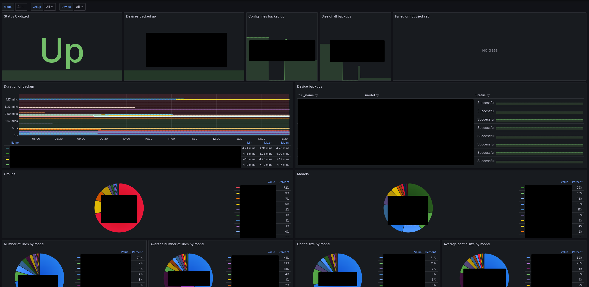

# Oxidized Prometheus Exporter

## Description

This exporter provides access to metrics sourced from Oxidized, a widely-used tool for backing up network device configurations. With this exporter, you can monitor diverse aspects of your Oxidized setup, encompassing device status, backup details, and configuration metrics.

### Metrics
- oxidized_status
- oxidized_exporter_collect_duration
- oxidized_device_status
- oxidized_device_last_backup_time
- oxidized_device_last_backup_start
- oxidized_device_last_backup_end
- oxidized_device_last_backup_status
- oxidized_device_config_size
- oxidized_device_config_lines

## Installation

You can install the Oxidized Prometheus Exporter either by downloading pre-built binaries, building it from source, or by using a pre-built container.

The exporter should run behind a reverse proxy, as it does not support TLS and authentication!

### Binary

Download the latest binary, RPM, or DEB package for Linux from the [releases](https://github.com/akquinet/oxidized-exporter/releases) section.


### Build from source

Clone the repository and build the exporter:

```bash
git clone https://github.com/akquinet/oxidized-exporter.git /tmp/oxidized-exporter
cd /tmp/oxidized-exporter
GOOS=linux GOARCH=amd64 CGO_ENABLED=0 go build -o oxidized-exporter
```

### Container

A container image is available under [packages](https://github.com/akquinet/oxidized-exporter/pkgs/container/oxidized-exporter).

You can use Docker Compose to deploy the exporter alongside Oxidized:

```yaml
---
version: "3.5"

services:
  oxidized:
    restart: unless-stopped
    image: oxidized/oxidized:0.29.1
    ports:
      - 127.0.0.1:8088:8888
    environment:
      - "CONFIG_RELOAD_INTERVAL=600"
    volumes:
      - "./data:/home/oxidized/.config/oxidized"
    env_file:
      - ".env"
    networks:
      - default

  oxidized-exporter:
    restart: unless-stopped
    image: ghcr.io/akquinet/oxidized-exporter:latest
    command:
      - "--verbose"
    ports:
      - 127.0.0.1:8089:8080
    environment:
      - "OXIDIZED_EXPORTER_URL=http://oxidized:8888/oxidized"
    env_file:
      - ".env"
    networks:
      - default
```

## Usage

The exporter supports various configuration options via command-line arguments or environment variables.  
Prefix all environment variables with OXIDIZED_EXPORTER.

```bash
# Show all available options
$ oxidized-exporter --help
Oxidized exporter for Prometheus

Usage:
  oxidized-exporter [flags]

Flags:
  -d, --debug         Enable debug logging
  -h, --help          help for oxidized-exporter
  -p, --pass string   Password for oxidized API
      --path string   Path to expose metrics on (default "/metrics")
      --port int      Port to listen on (default 8080)
  -U, --url string    URL of oxidized API (default "http://localhost:8888")
  -u, --user string   Username for oxidized API
  -v, --verbose       Enable verbose logging

# Run against an Oxidized instance with basic authentication
$ oxidized-exporter --url "https://oxidized.mydomain.com" -u myuser -p mypass --verbose

$ curl localhost:8080/metrics
```

## Prometheus Configuration
Integrate the exporter into Prometheus using the following configuration:

```yaml
- job_name: "oxidized_exporter"
  scrape_interval: 5m
  scrape_timeout: 300s
  scheme: "https"
  static_configs:
    - targets:
        - "oxidized.mydomain.com"
  basic_auth:
    username: "myuser"
    password: "mypass"
```

## Grafana Dashboard
A example Grafana dashboard is available under [docs/grafana-dashboard.json](docs/grafana-dashboard.json), offering insights into various metrics.
Import this dashboard into Grafana for visualization.



### Features

- Filter for model, group and device
- Show successful, failed and never backed up devices
- Show backup duration
- Show group and model statistics
- Show number of lines and size of the config for groups, models and devices
